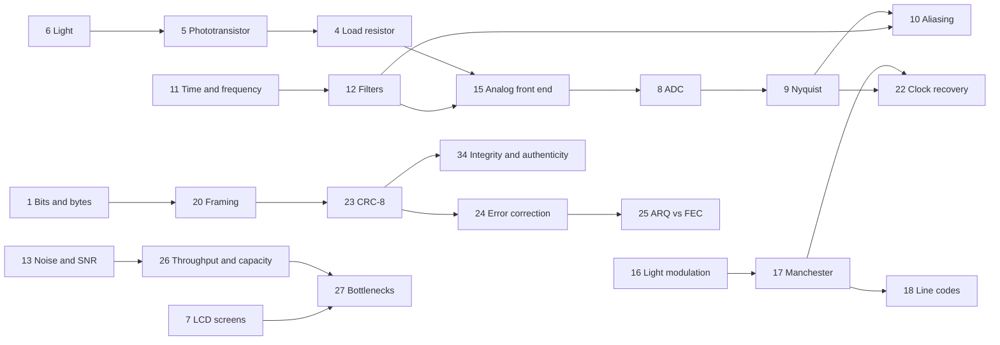

# Education guide

This guide teaches the ideas behind the **Optical Data Transfer Concept** at
three levels. A laptop screen flashes an encoded white/black patch, a
phototransistor on an Arduino Uno R4 measures it, and a Python decoder turns the
light back into the original bytes. Along the way the project touches almost
every layer of a real digital communications system: physics, electronics,
sampling, signal processing, line coding, framing, error control, and system
design. Every topic below connects back to something you can see, measure, or
change in this repository.

## How to use this guide

Pick a topic from the [contents](#contents). Each topic is written at three
levels, so read the one that fits you, or start at your level and read upward
when you're ready for more.

| Level | Assumes | Goal |
|---|---|---|
| 🟢 **High school** | Algebra and basic science | Build intuition: what is happening and why |
| 🔵 **Bachelor's** | Intro circuits, calculus, some programming | Explain how it works, with real numbers from this project |
| 🟣 **Master's** | Signals and systems, probability, communications | Analyze limits, tradeoffs, and how to redesign it |

Not sure where to start? See the suggested
[learning paths](#42-prerequisites-and-learning-paths) for each level.

Every topic ends with a link back to the contents. Topics marked *In this repo*
point to the project files where the idea lives.

## Contents

**Part 1: Foundations**
1. [Bits, bytes, hex, and text encoding](#1-bits-bytes-hex-and-text-encoding)
2. [File formats and magic numbers](#2-file-formats-and-magic-numbers)
3. [Endianness and bit order](#3-endianness-and-bit-order)
4. [Ohm's law and the load resistor](#4-ohms-law-and-the-load-resistor)
5. [How a phototransistor works](#5-how-a-phototransistor-works)
6. [Light and the visible spectrum](#6-light-and-the-visible-spectrum)
7. [How LCD screens work](#7-how-lcd-screens-work)

**Part 2: Signals and sampling**

8. [Analog-to-digital conversion](#8-analog-to-digital-conversion)
9. [Sampling and the Nyquist limit](#9-sampling-and-the-nyquist-limit)
10. [Aliasing in depth](#10-aliasing-in-depth)
11. [Time domain and frequency domain](#11-time-domain-and-frequency-domain)
12. [Filters](#12-filters)
13. [Noise, SNR, and decibels](#13-noise-snr-and-decibels)
14. [Thresholds and hysteresis](#14-thresholds-and-hysteresis)
15. [The receiver's analog front end](#15-the-receivers-analog-front-end)

**Part 3: Communications**

16. [Light modulation and IM/DD](#16-light-modulation-and-imdd)
17. [Line coding: Manchester encoding](#17-line-coding-manchester-encoding)
18. [Comparing line codes](#18-comparing-line-codes)
19. [Other modulation schemes](#19-other-modulation-schemes)
20. [Framing and synchronization](#20-framing-and-synchronization)
21. [Preambles in real systems](#21-preambles-in-real-systems)
22. [Clock and timing recovery](#22-clock-and-timing-recovery)
23. [Error detection with CRC-8](#23-error-detection-with-crc-8)
24. [Error correction](#24-error-correction)
25. [ARQ vs. FEC](#25-arq-vs-fec)
26. [Bit rate, baud, and throughput](#26-bit-rate-baud-and-throughput)
27. [Link budget and system bottlenecks](#27-link-budget-and-system-bottlenecks)
28. [Mapping the project onto the OSI model](#28-mapping-the-project-onto-the-osi-model)

**Part 4: Real-world connections**

29. [Li-Fi and visible light communication](#29-li-fi-and-visible-light-communication)
30. [Fiber optics](#30-fiber-optics)
31. [History of optical signaling](#31-history-of-optical-signaling)
32. [Everyday optical data](#32-everyday-optical-data)

**Part 5: Security**

33. [Optical covert channels and air-gap security](#33-optical-covert-channels-and-air-gap-security)
34. [Integrity, authenticity, and confidentiality](#34-integrity-authenticity-and-confidentiality)

**Part 6: Engineering practice**

35. [Debugging methodology](#35-debugging-methodology)
36. [Instrumentation](#36-instrumentation)
37. [Embedded timing](#37-embedded-timing)
38. [Data ethics in demos](#38-data-ethics-in-demos)

**Part 7: Teaching materials**

39. [Lab worksheets](#39-lab-worksheets)
40. [Quiz with answer keys](#40-quiz-with-answer-keys)
41. [Glossary](#41-glossary)
42. [Prerequisites and learning paths](#42-prerequisites-and-learning-paths)

---

## Part 1: Foundations

### 1. Bits, bytes, hex, and text encoding

**🟢 High school.** A *bit* is a single yes/no value, written 1 or 0. In this
project a bit ends up as light: bright or dark. Eight bits make a *byte*, which
can hold 256 different values (0–255). Text is stored by giving every character
a number; in the ASCII code, "H" is 72 and "I" is 73. Programmers often write
bytes in *hexadecimal* (base 16), where each hex digit stands for exactly 4
bits, so every byte is two hex digits: 72 = `0x48` = `0100 1000`. When the
transmitter sends "HI", it is really sending the two bytes `0x48 0x49`, which is
16 bits of light. A photo or a spreadsheet is no different, just a longer list
of bytes. That is the core idea of the whole project: **a file is just bytes,
and bytes can travel as light.**

**🔵 Bachelor's.** ASCII defines 128 seven-bit codes. UTF-8 extends this to all
of Unicode using 1 to 4 bytes per character while staying backward-compatible
with ASCII: `é` is `C3 A9` and 😀 is `F0 9F 98 80`. So the *byte* count, not
the character count, sets the frame's length field and the airtime: one emoji
costs 32 bits, about 2 seconds at 15 bps. The decoder decodes text frames as
UTF-8 with replacement, so a damaged multi-byte character prints as `�` instead
of crashing the program. Converting between binary and hex is just grouping bits
into fours (nibbles), which is why hex is the standard way to inspect raw data.

**🟣 Master's.** The link is semantically agnostic: the only metadata about
meaning is the type byte (`0x00` text, `0x01` file), a minimal content-type
field in the spirit of MIME types. UTF-8 is *self-synchronizing*: continuation
bytes (`10xxxxxx`) are distinguishable from lead bytes, so a reader that starts
mid-stream can find the next character boundary. That is the same design goal
the preamble and sync word solve one layer down, at the bit level. Note also the
gap between representation and information: English text carries roughly 1 bit
of entropy per character (Shannon's 1951 estimates) but costs 8 bits in ASCII.
Compressing before transmission would cut airtime, but it makes the stream
fragile, since one bit error can corrupt everything after it in a compressed
block. Where would compression sit in this stack, and how would it interact with
a CRC-only, no-FEC link?

*In this repo:* the "HI" worked example in [PROTOCOL.md](../docs/PROTOCOL.md#worked-example-the-text-hi).

[↑ Back to contents](#contents)

### 2. File formats and magic numbers

**🟢 High school.** A file's name ending (`.png`, `.csv`) is only a label; the
bytes inside decide what the file really is. Many formats begin with a fixed
"signature" called a *magic number*. Every PNG image starts with the same 8
bytes, and the decoder looks for them to decide whether to save a received file
as `.png`. A CSV is plain text: one row per line, values separated by commas.
Files can also hide extra bytes you never see. The project's 16×16 smiley is
127 bytes of picture, but one copy carried about 5,700 bytes of hidden metadata,
which would have turned a 72-second transfer into a 52-minute one.

**🔵 Bachelor's.** A PNG is an 8-byte signature, `89 50 4E 47 0D 0A 1A 0A`,
followed by *chunks*. Each chunk is a 4-byte big-endian length, a 4-letter type,
the data, and a CRC-32. The required chunks are IHDR (size and color type), IDAT
(compressed pixels), and IEND; optional chunks carry text, timestamps, or
provenance (the bloated smiley had a `caBX` chunk holding C2PA content
credentials). The signature bytes each do a job: `0x89` has its top bit set to
catch channels that strip bit 7; `CR LF` catches line-ending conversion; `0x1A`
stops a DOS `type` listing; the final `LF` catches LF→CRLF conversion. Other
signatures: JPEG `FF D8 FF`, PDF `%PDF`, ZIP `PK 03 04`. The decoder's rule:
PNG signature → `.png`; printable ASCII with commas and newlines → `.csv`;
anything else → `.bin`.

**🟣 Master's.** Content sniffing is a heuristic classifier, and an ambiguous
one: any ASCII text with commas "is" CSV, and crafted *polyglot* files can be
valid in two formats at once, a known source of security bugs in browsers and
upload filters. PNG's per-chunk CRC-32 means a PNG received over this link is
integrity-checked twice (frame CRC-8 plus chunk CRC-32); a smarter receiver could
use the chunk CRCs to localize corruption within a damaged frame. Metadata is
both a privacy channel (EXIF GPS coordinates, provenance records) and a
bandwidth cost, so stripping it is a data-minimization step. Exercise: dump the
127-byte smiley in hex and identify the IHDR, PLTE, IDAT, and IEND chunks and
their lengths (13, 9, 49, and 0 bytes).

*In this repo:* `emit()` in [optical_rx.py](../decoder/optical_rx.py); lesson 14 in [LESSONS.md](../docs/LESSONS.md#14-a-tiny-file-can-hide-a-lot-of-bytes).

[↑ Back to contents](#contents)

### 3. Endianness and bit order

**🟢 High school.** When a number needs more than one byte, the sender and
receiver have to agree which byte comes first. It's like dates: is 01/10 the
first of October or the tenth of January? *Big-endian* means the biggest part
comes first (the way we write numbers); *little-endian* means the smallest part
comes first. This project uses both: the Arduino sends each light reading
little-endian over USB, while the frame's length field travels big-endian over
the light. Inside each byte, the light link sends the most significant bit
first. Mix these up and you get numbers that look fine but are wrong.

**🔵 Bachelor's.** A sample of 1234 (`0x04D2`) leaves the Arduino as `D2 04`,
low byte first, which is native order for the Arm processor; Python unpacks it
with `struct` format `'<H'`. A length of 300 (`0x012C`) goes out over light as
`01 2C`, "network byte order" (`'>H'`). Bit order differs too: the UART inside
the USB-serial path sends each byte LSB-first, wrapped in a start bit and a stop
bit (10 bits per byte), while the optical link sends MSB-first. Neither choice is
"right"; what matters is that the specification states it and both ends agree.
The decoder even exploits the sample layout: the second byte of every pair is the
high byte, which can never exceed `0x3F` for 14-bit data, so an impossible value
reveals a misaligned stream.

**🟣 Master's.** Endianness is an interface-contract problem. Internet protocol
headers are big-endian while most CPUs (x86, Arm in its default mode) are
little-endian, so serialization code needs explicit conversions (`htons`,
`ntohs`, `struct` formats). Bit order also leaks into checksum definitions:
"reflected" CRC variants correspond to LSB-first serial hardware, non-reflected
ones to MSB-first. CRC-8/SMBUS is non-reflected, which matches this MSB-first
link. Exercise: if the Arduino streamed big-endian samples instead, what would
the decoder compute for a true reading of 4,500, and why would the alignment
check misfire? (It would read `(low << 8) | high`; the "high" byte is now the
true low byte, which often exceeds `0x3F`.)

*In this repo:* the interface contract in [PROTOCOL.md](../docs/PROTOCOL.md#receiver-interface-contract).

[↑ Back to contents](#contents)

### 4. Ohm's law and the load resistor

**🟢 High school.** Ohm's law says voltage = current × resistance (V = I × R).
The sensor acts like a light-controlled tap: more light lets more current flow.
Sending that current through a resistor produces a voltage the Arduino can
measure. A bigger resistor gives a bigger voltage for the same light, so the
receiver is more sensitive, but the Arduino can only measure up to 5 volts.
Make the resistor too big and bright light "clips" at the top, and every bright
reading looks the same. Choosing the resistor is a balance; for a laptop screen,
47 kΩ works well.

**🔵 Bachelor's.** In its active region the phototransistor behaves like a
light-controlled current source, so `V_A0 = I_C × R_L` as long as the transistor
stays out of saturation (the voltage across it can't fall below a few tenths of
a volt). A reading of 4,500 counts is about 1.37 V, which at 47 kΩ means
`I_C ≈ 29 µA`. The same current through 2 kΩ would give only about 0.06 V,
which is why a 2 kΩ load read just a few hundred counts on a screen. Tuning is a
constrained optimization: maximize the bright/dark swing, subject to the bright
level staying below about 15,500 counts and the RC speed rule in
[topic 15](#15-the-receivers-analog-front-end).

**🟣 Master's.** A resistive load couples gain and bandwidth: the
transimpedance gain is `R_L`, and the bandwidth is set by `R_L` times the total
capacitance at the node (the filter capacitor, the device, the ADC input). On
top of that, the phototransistor's collector–base capacitance is multiplied by
the Miller effect, so its response time grows with `R_L`. A transimpedance
amplifier (a photodiode at an op-amp's virtual ground, with feedback resistor
`R_f`) breaks that coupling by holding the detector at constant voltage, giving
a bandwidth of roughly `√(GBW / (2π R_f C_in))`. Note also that the
phototransistor's current gain varies with temperature and operating point, so
absolute calibration is poor; this design avoids needing it by thresholding
adaptively. Exercise: design a photodiode + TIA front end with the same gain and
ten times the bandwidth.

*In this repo:* [HARDWARE.md → Choosing the load resistor](../docs/HARDWARE.md#choosing-the-load-resistor).

[↑ Back to contents](#contents)

### 5. How a phototransistor works

**🟢 High school.** Light is made of tiny packets of energy called *photons*. In
a semiconductor like silicon, a photon with enough energy can knock an electron
loose, which creates a tiny electric current. A phototransistor builds that
light-sensitive spot into a transistor, which amplifies the tiny current by a
factor of a hundred or more. More light means more photons, more freed
electrons, and more current, and that current is what the Arduino ends up
measuring.

**🔵 Bachelor's.** The TEPT4400 is an NPN phototransistor. Its collector–base
junction is reverse-biased and exposed to light; absorbed photons create
electron–hole pairs, and the resulting photocurrent `I_p` acts as the base
current, so the collector current is about `(1 + β) × I_p`. A photon at 570 nm
carries `E = hc/λ ≈ 2.18 eV`, comfortably above silicon's 1.12 eV bandgap, so it
is absorbed; silicon stops responding beyond about 1,100 nm. For scale, 1 µW of
570 nm light is about 2.9 × 10¹² photons per second. With only two leads, the
base floats and is driven by light alone. Leakage ("dark current") sets the
floor when no light arrives.

**🟣 Master's.** Detector responsivity is `R = η q λ / (h c)` in A/W; at 570 nm
with quantum efficiency η = 0.7, a photodiode would give about 0.32 A/W, and a
phototransistor multiplies that by β. That gain costs speed: the Miller-
multiplied collector–base capacitance makes the response time scale with the
load resistance, which is why fast optical links use photodiodes. The TEPT4400 is
spectrally shaped to approximate the eye's photopic curve, whereas bare silicon
peaks in the near infrared. Its noise includes shot noise on the photocurrent,
amplified by β, plus excess noise from the transistor. Response is roughly linear
over several decades of irradiance until the transistor saturates.

*In this repo:* [HARDWARE.md → About the sensor](../docs/HARDWARE.md#about-the-sensor).

[↑ Back to contents](#contents)

### 6. Light and the visible spectrum

**🟢 High school.** Light is an electromagnetic wave, like radio, but with far
shorter waves. Our eyes see wavelengths from about 380 nm (violet) to 750 nm
(red); infrared is longer and invisible, which is what TV remotes use. The
project's sensor is tuned to respond roughly the way your eye does, most
strongly to yellow-green light around 570 nm. A laptop screen looks bright to us,
but it spreads its light out gently, so to the sensor it is much weaker than a
flashlight pressed against it. That's why the sensor has to be pressed flat
against the screen.

**🔵 Bachelor's.** Frequency and wavelength are linked by `c = λf`; 570 nm is
about 526 THz. The eye's daytime (photopic) sensitivity peaks at 555 nm, and
photometric units like lumens weight optical power by that curve. A screen's
"white" is a mix of red, green, and blue bands (typically a blue LED plus
phosphors or quantum dots); the TEPT4400 responds from about 440 to 800 nm, so
it sees mostly the green and red parts. Geometry matters as much as brightness:
the sensor only accepts light within about ±30° of its axis, so pressing it
flush against the screen collects light from the patch and excludes the room.
Room lighting is the main interferer, since mains-powered lamps flicker at 100 or
120 Hz.

**🟣 Master's.** Radiometry explains why contact works. For an extended
Lambertian emitter of radiance `L` that fills the detector's acceptance cone of
half-angle θ, the irradiance is `E = π L sin²θ`, independent of distance as long
as the patch fills the field of view (radiance is conserved). Once the patch
underfills the cone, irradiance falls roughly with the square of distance. The
effective signal also depends on the *spectral mismatch* between the source's
spectrum and the detector's responsivity: two screens with equal luminance can
produce different photocurrents. Exercise: from a typical laptop luminance of
300–500 cd/m², estimate the irradiance at the sensor and the expected
photocurrent, then compare with the measured swing.

*In this repo:* lesson 1 in [LESSONS.md](../docs/LESSONS.md#1-the-sensor-is-visible-light-not-infrared).

[↑ Back to contents](#contents)

### 7. How LCD screens work

**🟢 High school.** An LCD pixel doesn't make its own light. A backlight (usually
LEDs) shines all the time, and a layer of liquid crystals between two polarizing
filters acts like millions of tiny shutters that open (white) or close (black).
The shutters take time to move, about 10 to 20 thousandths of a second, and the
screen only redraws 60 times a second. That's why a screen can't flash much
faster than 30 times a second, which caps this project at 15 to 30 bits per
second. Black isn't perfectly black, either: some backlight always leaks
through.

**🔵 Bachelor's.** Voltage across each liquid-crystal cell changes how much it
rotates the light's polarization between the two polarizers, so transmission is
continuous (that's how gray levels work). Gray-to-gray response times are
typically 5–25 ms, and at 60 Hz each frame lasts 16.7 ms; the transmitter makes
one bright/dark decision per frame, so the bit rate is quantized to
`60 / (2n)` for n frames per symbol. Many backlights are dimmed by PWM (switching
on and off at hundreds of Hz to tens of kHz), and maximum brightness often means
100% duty, a steady backlight. IPS contrast is around 1000:1, so "black" still
emits light. Adaptive features such as auto-brightness, content-adaptive
backlight control, and mini-LED local dimming change the backlight based on what
is on screen, which acts like an automatic gain control fighting the signal.
OLED pixels emit their own light and respond in under a millisecond, but they are
often PWM-dimmed too.

**🟣 Master's.** Model the display as a frame-synchronous discrete-time channel
with an asymmetric, roughly first-order pixel response (panel overdrive can add
overshoot). At one frame per symbol, a pixel hasn't fully settled before the next
symbol, which causes intersymbol interference. A PWM backlight *multiplies* the
optical signal, `s(t)·p(t)`, creating spectral copies around the PWM frequency
and its harmonics, which become aliasing hazards at the 600 Hz sampler (see
[topic 10](#10-aliasing-in-depth)). Content-adaptive dimming adds a
signal-dependent gain: a nonlinear, time-varying channel that breaks the
receiver's assumption of steady levels. The adaptive threshold tracks slow drift
but not fast content-driven gain steps. Exercise: at frames/symbol 1, use a
`--record` capture to fit separate rise and fall time constants and estimate how
much eye opening is lost to ISI.

*In this repo:* [README → Choosing a screen](../README.md#choosing-a-screen); lesson 6 in [LESSONS.md](../docs/LESSONS.md#6-backlight-behavior-dominates-a-weak-screen-signal).

[↑ Back to contents](#contents)

---

## Part 2: Signals and sampling

### 8. Analog-to-digital conversion

**🟢 High school.** An ADC (analog-to-digital converter) turns a voltage, which
can be any value, into a whole number a computer can store. The Arduino's ADC is
set to 14 bits, which splits the 0–5 V range into 16,384 steps (0 to 16,383).
Each step is about 0.3 thousandths of a volt; anything finer gets rounded to the
nearest step. In this project, dark reads near 0 and a bright screen reads a few
thousand. The Arduino takes 600 of these readings every second and sends them
all to the laptop.

**🔵 Bachelor's.** The Uno R4's microcontroller uses a successive-approximation
(SAR) ADC: a sample-and-hold capacitor captures the input, then a binary search
against an internal DAC finds the code, one bit per step. During acquisition the
hold capacitor charges from the source, so a high source impedance like 47 kΩ
can cause errors; the 10 nF filter capacitor acts as a local charge reservoir
that prevents this. One LSB is `5 V / 2¹⁴ ≈ 305 µV`, and quantization noise is
`LSB/√12 ≈ 0.29 counts` RMS. The ideal SNR of a 14-bit converter is
`6.02N + 1.76 ≈ 86 dB`, far beyond this system's real SNR of about 23 dB (see
[topic 13](#13-noise-snr-and-decibels)), so resolution isn't the limiting factor.
The ADC's reference is the 5 V supply, so supply variation shows up as a small
gain change, which the adaptive threshold absorbs.

**🟣 Master's.** Nominal bits are not effective bits: noise, differential and
integral nonlinearity, and reference noise reduce ENOB, which you can measure by
histogramming readings of a steady input. Because the sensor's output voltage is
`I·R` (not a fraction of the supply) while the ADC references the supply, USB
supply ripple appears as multiplicative gain noise rather than additive noise.
Aperture jitter is irrelevant at 600 Hz. Averaging is the important effect: for
white noise, averaging M samples improves SNR by `√M`. The decoder's half-bit
energy comparison does exactly this, integrating 20 samples per half-bit at
15 bps for about 13 dB of processing gain against white noise, though none
against correlated in-band interference. Exercise: measure ENOB with the sensor
covered, then again with a steady white screen, and explain the difference.

*In this repo:* [optical_receiver_stream.ino](../firmware/optical_receiver_stream/optical_receiver_stream.ino); [HARDWARE.md → The filter capacitor](../docs/HARDWARE.md#the-filter-capacitor).

[↑ Back to contents](#contents)

### 9. Sampling and the Nyquist limit

**🟢 High school.** To capture something that changes, you have to look at it
often enough. The Nyquist rule says you must sample at least twice as fast as
the fastest change you want to capture. The Arduino samples 600 times per
second, so it can faithfully capture changes up to 300 times per second (300 Hz).
Anything faster doesn't just get missed: it shows up disguised as a slower
change that isn't really there, like a wagon wheel in a movie that seems to spin
backward. That disguise is called *aliasing*.

**🔵 Bachelor's.** The sampling theorem: a signal band-limited to `f_max` can be
reconstructed exactly from samples taken at `f_s > 2 f_max`. Half the sample rate,
`f_s / 2`, is the *Nyquist frequency*: 300 Hz here. The data signal's useful
content sits well below that (tens of Hz at 15–30 bps), so the receiver is
oversampled by about 10×, which yields many samples per symbol (20 per half-bit
at 15 bps) for robust energy comparison and timing. Any interference above
300 Hz must be removed *before* the ADC, with an analog filter, because once it
has aliased it can't be separated from the signal.

**🟣 Master's.** Sampling multiplies the signal by an impulse train, which
replicates its spectrum at every multiple of `f_s`; aliasing is the overlap of
those replicas. The optical square wave is not band-limited (its harmonics
extend indefinitely), but that's harmless here because the receiver makes
decisions rather than reconstructing the waveform, and the half-bit integrator
tolerates the signal's own aliased harmonics. Aliased *interferers* are the real
hazard. Sampling-clock jitter adds phase noise with SNR about
`−20 log₁₀(2π f σ_t)`; for a 30 Hz component and 5 µs of jitter that's about
60 dB, negligible. Bandpass sampling, where a narrowband signal is deliberately
aliased down, is a useful contrast case for discussion.

*In this repo:* `SAMPLE_HZ` in the firmware; `SAMPLE_RATE` in the decoder.

[↑ Back to contents](#contents)

### 10. Aliasing in depth

**🟢 High school.** Aliasing makes fast flicker look slow after sampling. If a
light flickers 590 times a second and you sample 600 times a second, each sample
catches the flicker a little later in its cycle, and the samples trace out a slow
10-times-a-second wobble. That fake wobble lands right where the data lives, and
nothing in software can tell it apart from real signal. That's why the project
filters fast flicker electrically before sampling.

**🔵 Bachelor's.** A tone at frequency `f` appears at `|f − k·f_s|` for whichever
integer `k` puts the result between 0 and `f_s / 2`. At 600 Hz: 590 Hz → 10 Hz,
650 Hz → 50 Hz, 1,000 Hz → 200 Hz. **Hands-on demo with this hardware:** type a
message of capital U's (`UUUUUUUUUUUUUUUUUUUU`; `U` is `0x55` = `01010101`) into
the transmitter at frames/symbol 1. Alternating bits Manchester-encode to a
steady square wave at half the bit rate, about 15 Hz. View it with
`sensor_test` in the Serial Plotter, which samples at roughly 500 Hz, and you see
15 Hz. Now change `delay(2)` to `delay(50)` (about 20 samples per second,
Nyquist about 10 Hz): the plot shows a slow wave near 5 Hz that isn't really
there. The exact alias depends on the real loop rate, since printing takes time
too.

**🟣 Master's.** Anti-alias design starts from the required attenuation at the
frequencies that fold into the band. The single-pole RC (339 Hz corner) gives
only about 6 dB at 590 Hz; a second-order Butterworth at 100 Hz would give about
31 dB, at the cost of more group delay eating into timing margin. A PWM
backlight multiplies the signal, so it creates sidebands at `f_pwm ± f_signal`
that alias to `|f_pwm − k·f_s| ± f_signal`. Randomized (non-uniform) sampling
spreads alias energy into a noise floor instead of a coherent tone, a trade worth
discussing. Exercise: compare a 240 Hz PWM backlight (below Nyquist; the
decoder's software filter attenuates it by about 22 dB) with a 590 Hz one (which
aliases to 10 Hz, inside the passband, where software can't help).

*In this repo:* lesson 10 in [LESSONS.md](../docs/LESSONS.md#10-aliasing-cant-be-fixed-in-software); [test/sensor_test](../test/sensor_test/sensor_test.ino).

[↑ Back to contents](#contents)

### 11. Time domain and frequency domain

**🟢 High school.** There are two ways to describe a signal. The *time domain*
is the graph you see in the Serial Plotter: brightness changing over time. The
*frequency domain* describes the same signal as a recipe of steady tones added
together, like a musical chord built from notes. A sharp on/off flash contains a
main tone plus many higher "overtones." Filters work on the recipe: they let
some tones through and block others. Thinking in frequencies explains why the
project can separate its data (slow) from room-light flicker (faster).

**🔵 Bachelor's.** A square wave of frequency f is
`(4/π) Σ sin(2π n f t) / n` over odd n: harmonics at 3f, 5f, and so on, with
amplitudes falling as 1/n. In this link, a run of alternating bits gives a
square wave at half the bit rate (7.5 Hz at 15 bps), and a run of identical bits
gives one at the bit rate (15 Hz), so the data's energy sits mostly between about
5 and 30 Hz plus harmonics. Room-light flicker sits at 100/120 Hz and backlight
PWM at hundreds of Hz or more, separated in frequency, which is what makes
filtering work. Try it: load a `--record` capture with NumPy and plot
`numpy.fft.rfft` of the samples to see the data band and the flicker lines.

**🟣 Master's.** For bipolar Manchester with bit period T, the power spectral
density is `S(f) = A²T · sin⁴(πfT/2) / (πfT/2)²`: zero at DC, peaking near
`f ≈ 0.74/T`, with its first null at `2/T`. Compared with NRZ, whose spectrum
peaks at DC and first nulls at `1/T`, Manchester needs about twice the
bandwidth. Light intensity can't be negative, so the optical signal is unipolar:
`s(t) = (A/2)(1 + m(t))`, which adds a DC line to the Manchester spectrum. The
decoder's half-bit comparison is blind to that DC term and to slow ambient
drift, which is precisely why Manchester suits intensity-modulated links. The
LCD's finite response acts as a low-pass channel that causes ISI at short
symbol times. Exercise: compute a periodogram of a capture, identify the
Manchester lobe, 100/120 Hz flicker, and any aliased PWM tones.

[↑ Back to contents](#contents)

### 12. Filters

**🟢 High school.** A filter lets some frequencies through and blocks others. A
*low-pass* filter keeps slow changes and smooths out fast wiggles. This project
uses two: an electrical one (a resistor and a capacitor) right before the
Arduino, and a mathematical one inside the Python decoder. The electrical one
must come first, because it removes very fast flicker before sampling, which no
software can undo afterward.

**🔵 Bachelor's.** The analog RC low-pass has
`H(f) = 1 / (1 + j f/f_c)` with `f_c = 1/(2πRC)`: 339 Hz for 47 kΩ and 10 nF,
rolling off at −20 dB per decade, with time constant `τ = RC = 0.47 ms`. The
digital filter is a one-pole IIR filter (an exponential moving average),
`y[n] = y[n−1] + α (x[n] − y[n−1])`, with `α = 1/(1 + f_s/(2π f_c)) ≈ 0.42` for
a nominal 70 Hz, applied twice in cascade (two poles, −40 dB per decade).
Computed response: about −2.4 dB at 30 Hz, −15 dB at 120 Hz, and −21 dB at
200 Hz. It passes the data band at 15–30 bps while cutting room-light flicker.

**🟣 Master's.** The α mapping only approximates an analog RC in discrete time:
each stage's actual −3 dB point is about 54 Hz rather than 70, and cascading two
identical poles moves the overall −3 dB point to about 34 Hz. That's still
adequate, but worth verifying whenever a filter is "designed" by formula.
IIR filters have frequency-dependent group delay, which distorts symbol shape
and adds ISI; a constant delay would be harmless. A linear-phase FIR avoids that
at higher compute cost, and the optimal detector for rectangular symbols is the
integrate-and-dump (matched) filter, which the decoder's half-bit mean
effectively implements. Exercise: replace the cascade with a second-order
Butterworth biquad designed by the bilinear transform, and compare decode
margins on replayed captures.

*In this repo:* `lowpass()` in [optical_rx.py](../decoder/optical_rx.py); [HARDWARE.md → Speed](../docs/HARDWARE.md#speed-the-resistor-and-capacitor-form-a-low-pass-filter).

[↑ Back to contents](#contents)

### 13. Noise, SNR, and decibels

**🟢 High school.** *Noise* is unwanted wobble on top of the signal. The
*signal-to-noise ratio* (SNR) compares the signal's size with the noise's size;
bigger is better. Engineers use *decibels* (dB) to handle huge ratios: every 10×
in amplitude adds 20 dB. In this project the bright/dark swing is about 4,500
counts and the leftover wobble is about ±300 counts, a ratio of about 15, or
roughly 23 dB. Most of that wobble isn't random electronic hiss; it's flicker
from room lights and the screen's backlight. That's why the black shroud helps
so much.

**🔵 Bachelor's.** Decibels: power ratios use `10 log₁₀`, amplitude ratios
`20 log₁₀`. Compare the electronic noise sources at the 47 kΩ node over a
~300 Hz bandwidth with the observed noise:
- Thermal (Johnson) noise, `√(4kTRB)`: about 0.5 µV, or 0.002 counts.
- Shot noise at `I_C ≈ 29 µA`, `√(2qIB) × R`: about 2.5 µV, or 0.008 counts.
- Quantization noise: about 0.29 counts RMS.
- Observed residual: about ±300 counts (±92 mV).

The electronic sources are five orders of magnitude too small. The link is
**interference-limited** (room-light flicker, backlight PWM, light leaks,
mechanical movement), not noise-limited. So the fixes are optical and spectral:
seal the shroud, raise brightness, and filter. Lower-noise electronics wouldn't
help.

**🟣 Master's.** With Gaussian noise, binary decisions have error probability
`Q(d / 2σ)` for level separation d. Taking ±300 counts as roughly 3σ gives
`d/2σ ≈ 22`, a vanishingly small error rate, yet frames do fail in practice. So
errors are dominated by structured, non-Gaussian impairments: timing slips, ISI
from the LCD, gain steps from adaptive backlights, and throttled animation
frames. SNR alone is a poor predictor of reliability when impairments are
structured. Half-bit integration gives about 13 dB of processing gain against
white noise but none against correlated in-band interference. Exercise:
estimate σ from a steady capture, then classify the error events in a failing
replay by cause.

[↑ Back to contents](#contents)

### 14. Thresholds and hysteresis

**🟢 High school.** To decide "bright" or "dark," the decoder draws a dividing
line halfway between the brightest and darkest readings. A fixed line would
break whenever the room or screen changed, so the decoder keeps tracking the
brightest and darkest levels and moves the line with them. It also uses
*hysteresis*: two lines a little apart, one for going up and one for going
down, so small wobbles near the line don't cause false flips. A thermostat
does the same thing when it turns the heat on at 19° and off at 21°.

**🔵 Bachelor's.** The decoder's peak tracker snaps its maximum up to any new
high instantly, then lets it relax slowly toward the signal (`relax = 0.002` per
sample, a time constant of about 500 samples, or 0.8 s); the minimum works the
same way. The threshold is the midpoint, and the hysteresis band is ±6% of the
buffer's overall span, a software Schmitt trigger. These thresholded edges feed
clock recovery only. The bit decisions themselves don't use a threshold; they
compare the average brightness of the two halves of each bit.

**🟣 Master's.** Threshold estimation is a tracking problem: the decay rate
trades responsiveness against sensitivity to outliers, and a single spike resets
the max or min instantly (the low-pass prefilter mitigates this). Hysteresis
detects edges late by roughly `h / slope`; with the LCD's asymmetric rise and
fall, that becomes a systematic edge-timing offset, which the decoder tolerates
because it decides on energy windows rather than edge positions. The hysteresis
band is computed from the whole buffer's span, so in a long buffer with drifting
levels it can be locally too large or too small. Alternatives include
decision-directed level estimation, two-cluster k-means on the sample
histogram, and closed-loop AGC. Exercise: make the hysteresis band local and
measure the effect on replays with drifting brightness.

*In this repo:* `threshold_series()` and `edges_from()` in [optical_rx.py](../decoder/optical_rx.py).

[↑ Back to contents](#contents)

### 15. The receiver's analog front end

**🟢 High school.** The receiver circuit has three parts. The sensor turns light
into current, the resistor turns current into voltage, and a small capacitor
smooths out flicker that's too fast to matter, like a shock absorber. The
voltage goes into the Arduino's A0 pin. The resistor's size sets how sensitive
the receiver is; the resistor and capacitor together set how fast it can follow
the flashing light.

**🔵 Bachelor's.** This is a resistive transimpedance front end:
`V = I_C × R_L`. The resistor and the shunt capacitor form a single-pole RC
low-pass with `τ = R_L C`. The design rule is `τ ≤ (half-bit period) / 10`,
because Manchester switches at the half-bit rate: `τ ≤ 3.3 ms` at 15 bps and
`τ ≤ 1.7 ms` at 30 bps, so with 10 nF the resistor can be at most about 330 kΩ
or 167 kΩ respectively. `R_L` is chosen empirically for maximum swing without
clipping. This is a classic instrumentation tradeoff: a bigger `R_L` gives more
gain *and* a larger `τ`, coupling gain and bandwidth through one component.

**🟣 Master's.** The front end's noise is negligible next to optical
interference (see [topic 13](#13-noise-snr-and-decibels)), so its real job is
interference rejection and anti-aliasing. A single pole rolls off at only 20 dB
per decade, too gentle to suppress a backlight PWM tone an octave above the
corner. A second- or fourth-order active filter (Sallen-Key or multiple
feedback) placed before the ADC would give much more stopband attenuation, at
the cost of group delay that eats into clock-recovery margin. A TIA front end
(see [topic 4](#4-ohms-law-and-the-load-resistor)) would decouple gain from
bandwidth. Assignment: given a target alias rejection of 40 dB at a measured PWM
frequency, size a second-order filter, then compare its step-response settling
and group delay with the 1-pole baseline.

*In this repo:* [HARDWARE.md](../docs/HARDWARE.md); [TESTING.md Phase 5](../docs/TESTING.md#phase-5-choose-the-screen-and-tune-the-load-resistor).

[↑ Back to contents](#contents)

---

## Part 3: Communications

### 16. Light modulation and IM/DD

**🟢 High school.** *Modulation* means changing something about a wave so it
carries information. With light you could change its brightness, its color, its
timing, or its polarization. This project changes only brightness, switching
between bright and dark. That simplest form is called *on-off keying* (OOK). It's
the same basic idea as Li-Fi and the fiber-optic cables that carry the internet,
just much, much slower.

**🔵 Bachelor's.** The precise name is **intensity modulation with direct
detection (IM/DD)**: the transmitter varies optical power, and the receiver
measures power directly (photocurrent is proportional to optical power), ignoring
the light's phase. Unlike AM radio, there is no carrier being modulated; the
signal is at baseband, just the light switched according to the
Manchester-encoded bits. Because intensity can't be negative, the signal is
unipolar and always carries a DC offset. IM/DD underlies Li-Fi, short-reach
fiber links (NRZ or PAM-4), and infrared links, though IR remotes add a 38 kHz
subcarrier to reject ambient light.

**🟣 Master's.** The IM/DD channel model is `y(t) = R · (h ∗ x)(t) + n(t)` with
`x(t) ≥ 0` and constraints on *average and peak optical* power, which differ from
RF's average *electrical* power constraint. That changes capacity results and
the best modulations; see Lapidoth, Moser, and Wigger (2009) on free-space
optical intensity channels. Common IM/DD modulations are OOK, pulse-position
modulation (power-efficient), PAM (bandwidth-efficient), and optical OFDM
variants (DCO-OFDM and ACO-OFDM, which need Hermitian symmetry for a real output,
plus biasing or clipping to keep it non-negative). Contrast this with coherent
optical systems, which modulate phase and polarization and detect with a local
oscillator.

[↑ Back to contents](#contents)

### 17. Line coding: Manchester encoding

**🟢 High school.** Instead of sending 1 as "light on" and 0 as "light off,"
Manchester encoding sends each bit as a *change*: 1 is bright-then-dark, 0 is
dark-then-bright. Every bit always has a change in the middle, so the receiver
can always tell where one bit ends and the next begins, without needing a shared
clock. The price is two flashes for every bit. For example, the letter H
(`01001000`) becomes 16 half-bit flashes:
`DB BD DB DB BD DB DB DB` (B = bright, D = dark).

**🔵 Bachelor's.** Manchester trades bandwidth for self-clocking: each bit
occupies two symbol periods, so the bit rate is half the symbol rate. The
guaranteed mid-bit transition gives the receiver a timing reference every bit,
which is why 10BASE-T Ethernet used it. The cost is roughly double the bandwidth
of NRZ at the same bit rate. This project uses the G. E. Thomas convention
(1 = high-to-low); IEEE 802.3 uses the opposite, so a specification must state
which. Manchester also has no DC component and no long runs, which makes the
receiver's adaptive threshold easy to keep centered.

**🟣 Master's.** Manchester is a bi-phase code with PSD
`S(f) ∝ sin⁴(πfT/2) / (πfT/2)²`: DC-free, peaking near `0.74/T`, first null at
`2/T` (see [topic 11](#11-time-domain-and-frequency-domain)). As a code, it has
rate 1/2, a maximum run length of two symbols, and perfect DC balance, and its
invalid symbol pairs (BB or DD at a mid-bit position) give free error detection.
The decoder doesn't threshold individual symbols: it compares the mean of the
first half-bit window with the second, which is equivalent to a matched filter
for the two antipodal symbol shapes and is robust to gain drift. Exercise:
derive the decision statistic's distribution under Gaussian noise, and compare
its error rate with a threshold slicer that has a level-estimation error ε.

*In this repo:* [PROTOCOL.md → Line coding](../docs/PROTOCOL.md#line-coding-manchester); `decode_bits()` in [optical_rx.py](../decoder/optical_rx.py).

[↑ Back to contents](#contents)

### 18. Comparing line codes

**🟢 High school.** There are many ways to turn bits into signal levels. The
simplest, NRZ, just uses "on" for 1 and "off" for 0, but a long run of the same
bit is a steady level with no changes, so the receiver loses track of timing.
Manchester always has a change, but it needs two flashes per bit. Other codes try
to get the best of both: enough changes to keep time, with less waste.

**🔵 Bachelor's.** Comparison:

| Code | Used in | Efficiency | Guaranteed transitions | DC-balanced |
|---|---|---|---|---|
| NRZ-L | UART, CAN (with bit stuffing) | 100% | No | No |
| NRZI | USB 1.x/2.0 (bit stuffing after six 1s) | 100% | Only with stuffing | No |
| Manchester | 10BASE-T Ethernet, RC-5 IR remotes, this project | 50% | Every bit | Yes |
| Differential Manchester | Token Ring (IEEE 802.5) | 50% | Every bit, polarity-insensitive | Yes |
| 4B/5B | 100BASE-TX, FDDI | 80% | At most 3 zeros in a row | No (paired with MLT-3/NRZI) |
| 8b/10b | Gigabit Ethernet (1000BASE-X), SATA, PCIe 1–2, USB 3.0 | 80% | Run length ≤ 5 | Yes |
| 64b/66b, 128b/130b | 10G Ethernet; PCIe 3.0+ | ~97–98% | Via scrambling | Statistically |

Exercise: at this screen's 30 symbols per second, 4B/5B with NRZI would carry
24 bps instead of Manchester's 15 bps, but with up to three symbol periods
without a transition. What would the decoder's clock recovery need to handle
that?

**🟣 Master's.** Run-length constraints are formalized as (d,k) RLL
constrained systems, whose capacity is `log₂ λ_max` of the constraint graph's
adjacency matrix: (0,1) gives 0.694 (log₂ of the golden ratio), (0,2) gives
0.879, and (0,3) gives 0.947 bits per symbol. A CD's EFM code is a (2,10) RLL
code. Manchester, viewed this way, is a rate-1/2 code with perfect DC balance
and k = 1, well below these capacities, which shows how much rate this link
gives up for simplicity. DC balance is tracked with the running digital sum;
8b/10b controls it with disparity. Exercise: verify the (0,k) capacities by
computing eigenvalues, and design a rate-2/3 code meeting a (0,2) constraint.

[↑ Back to contents](#contents)

### 19. Other modulation schemes

**🟢 High school.** On/off isn't the only option. *Pulse-position* schemes send
a short pulse at different moments to mean different values; TV remotes encode
bits in the timing between pulses. *Frequency-shift* keying uses different
flicker speeds for 0 and 1. *Color-shift* keying changes color. *Multi-level*
schemes use several brightness levels, so each flash carries more than one bit:
four gray levels carry two bits per flash.

**🔵 Bachelor's.** Examples:
- **NEC IR protocol:** bursts of a 38 kHz carrier, with bits encoded by the gap
  after each 562.5 µs burst (562.5 µs for 0, 1687.5 µs for 1).
- **Philips RC-5:** Manchester-coded bits on a 36 kHz carrier.
- **L-PPM:** each symbol is one pulse in one of L slots, carrying `log₂ L` bits;
  very power-efficient, bandwidth-hungry.
- **PAM-4:** four levels, 2 bits per symbol; used in 400G Ethernet optics and
  PCIe 6.0. On this screen, gray levels could double the rate per symbol, but the
  LCD's gamma curve and gray-to-gray response complicate it.
- **Color-shift keying (CSK):** defined in IEEE 802.15.7 for RGB LEDs.
- **Subcarrier FSK:** moves the signal away from DC and mains flicker.

**🟣 Master's.** For IM/DD, PPM sits at the power-efficient end and PAM at the
bandwidth-efficient end; optical OFDM handles dispersive channels at the cost of
high peak-to-average power ratio, which collides with LED nonlinearity and
clipping. This channel is *bandwidth-limited* (by LCD response) with high SNR
(~23 dB), which per Shannon favors multilevel signaling (see
[topic 26](#26-bit-rate-baud-and-throughput)). Exercise: design a PAM-4
constellation in sRGB values, accounting for gamma (about 2.2) so the four
*optical* levels are equally spaced, then specify the calibration step and the
equalizer the decoder would need to undo LCD intersymbol interference.

[↑ Back to contents](#contents)

### 20. Framing and synchronization

**🟢 High school.** Before the real message, the transmitter sends a repeating
flash pattern (the *preamble*) just so the receiver can lock on, then a fixed
marker byte (the *sync word*) meaning "the message starts now," then what kind of
message it is, how long it is, the message itself, and a checksum. A 2-byte
message like "HI" becomes a 9-byte frame: 72 bits, which is 144 flashes.

**🔵 Bachelor's.** The frame is
`preamble (16 b) | sync 0x7E | type (1 B) | length (2 B, big-endian) | payload | CRC-8 (1 B)`,
a fixed 56 bits of overhead plus 8 bits per payload byte:

| Payload | Frame bits | At 15 bps | At 30 bps |
|---|---|---|---|
| `HELLO OPTICAL WORLD` (19 B) | 208 | 14 s | 7 s |
| `demo.csv` (49 B) | 448 | 30 s | 15 s |
| `smiley-16.png` (127 B) | 1,072 | 72 s | 36 s |

The alternating preamble Manchester-encodes to an evenly spaced train of
transitions, ideal for the threshold tracker to settle and the clock to lock.
`0x7E` is the same value as HDLC's flag byte. There's no bit stuffing, so the
payload may contain `0x7E`; the parser treats each match as a candidate,
requires alternating preamble bits right before it, and confirms with the CRC,
moving on one bit if the check fails.

**🟣 Master's.** This is packet synchronization without bit stuffing or
scrambling: it relies on the statistical rarity of the 12-bit pattern (4
preamble bits plus the sync byte) in random data, about `2⁻¹²` per bit position,
plus CRC validation, rather than on a payload that structurally can't contain
the sync word. Rigorous alternatives are HDLC-style bit stuffing, or sync
sequences with good autocorrelation (such as Barker codes) so that misaligned
matches are weak. The fallback of advancing one bit and rescanning is linear in
the number of false syncs; at these frame sizes, with a 1-in-256 CRC false-accept
rate per false sync, it's a non-issue, but it wouldn't scale to long, noisy
streams. Exercise: compute the expected number of false sync candidates in a
5-minute live buffer at 15 bps, and the resulting probability that one also
passes the CRC.

*In this repo:* [PROTOCOL.md → Frame format](../docs/PROTOCOL.md#frame-format); `parse_frames()` in [optical_rx.py](../decoder/optical_rx.py).

[↑ Back to contents](#contents)

### 21. Preambles in real systems

**🟢 High school.** Lots of systems start each message with a "get ready"
pattern, like saying "Attention, please" before an announcement. Wired Ethernet,
the network cable in schools and offices, starts every packet with the same
alternating 1010… pattern this project uses.

**🔵 Bachelor's.** Examples:
- **Ethernet (IEEE 802.3):** seven bytes of `10101010` followed by the start
  frame delimiter `10101011` (as sent on the wire). On 10BASE-T, which used
  Manchester, that preamble is a clean square wave for clock lock, just like here.
- **Bluetooth Low Energy:** an 8-bit alternating preamble, then a 32-bit access
  address that acts as a sync word.
- **Wi-Fi (OFDM):** a short training field for gain control and coarse timing,
  then a long training field for channel estimation.
- **UART:** a single start bit, resynchronizing on every byte.
- **This project:** a 16-bit preamble plus a `0x7E` sync byte.

**🟣 Master's.** Preamble design balances overhead against acquisition
probability. Key properties are autocorrelation (802.11b's 11-chip Barker
sequence), support for frequency-offset estimation (repeated training symbols,
as in the Schmidl–Cox method), and enough length for AGC settling. Detection is
a hypothesis test with a tradeoff between false sync and missed sync, set by the
sync word length and how many bit errors are tolerated. This link has no carrier,
so there's no frequency offset to estimate, only symbol timing and level; that's
why a short alternating preamble suffices. Exercise: for sync-word lengths of 8,
16, and 32 bits and tolerances of 0, 1, or 2 bit errors, tabulate false-sync and
miss probabilities at a raw BER of 10⁻³.

[↑ Back to contents](#contents)

### 22. Clock and timing recovery

**🟢 High school.** The transmitter's flashes are never perfectly evenly spaced,
since browsers and screens are a little sloppy about timing. So the receiver
doesn't just assume a fixed beat. It measures the beat from the preamble, then
keeps re-checking against each real flash change as it goes, so small timing
errors can't pile up over a long message.

**🔵 Bachelor's.** `recover_clock()` estimates the bit period from a run of at
least 8 near-equal edge intervals (the median interval, within ±30%), and takes
the first edge of the run as a mid-bit anchor. `decode_bits()` then steps one bit
period at a time and re-anchors to the nearest real edge within ±0.35 of a bit.
That excludes boundary edges, which sit half a bit away. This is decision-
directed timing recovery, conceptually similar to an early-late gate. It matters
because the transmitter's clock is the browser's animation loop, which jitters
and can throttle badly when a tab loses focus. Two details from testing: a run of
identical payload bits produces edges half a bit apart, which the decoder now
recognizes and corrects for; and the gap between looped frames is rounded to
whole bits so the clock stays in phase across it.

**🟣 Master's.** This is non-coherent symbol-timing recovery at baseband: no
carrier recovery is needed, but the problem (estimating and tracking an unknown,
slowly varying period from a self-clocking code) is the same one addressed by
Gardner and Mueller–Müller timing error detectors in digital receivers. Here
correction is open-loop re-snapping rather than a filtered closed loop, so it
has no noise averaging: each re-anchor inherits that edge's timing noise. During
an edge-free gap the clock free-runs, which is why fractional-bit gaps caused
half-bit slips. Exercise: derive the maximum tolerable per-bit timing drift as a
fraction of the bit period for the half-bit energy decision at about 23 dB SNR,
then compare with the 0.3–0.4% drift cases the self-test passes. Does the scheme
have real margin?

*In this repo:* `recover_clock()` and `decode_bits()` in [optical_rx.py](../decoder/optical_rx.py); lessons 11 and 15 in [LESSONS.md](../docs/LESSONS.md).

[↑ Back to contents](#contents)

### 23. Error detection with CRC-8

**🟢 High school.** After building the message, the transmitter runs a math
recipe over the bytes and attaches the result: a one-byte *checksum*. The
receiver runs the same recipe; if its answer doesn't match, it knows something
got corrupted and throws the message away. It can't fix the message, only notice
the problem, so the transmitter keeps repeating until a clean copy gets through.

**🔵 Bachelor's.** The checksum is CRC-8/SMBUS: generator polynomial `0x07`
(`x⁸ + x² + x + 1`), initial value `0x00`, no reflection, no final XOR, check
value `0xF4` for the ASCII string `"123456789"`. It covers the type, length, and
payload bytes, and is computed bit-serially by shift-and-XOR. Its guarantees:
- every single-bit error is detected;
- every error with an odd number of flipped bits is detected, because the
  polynomial is divisible by `(x + 1)`;
- every burst error of 8 bits or fewer is detected;
- otherwise, a random corruption slips through with probability about 1/256.

There's no forward error correction: a failed frame is simply discarded.

**🟣 Master's.** Over GF(2), `g(x) = (x + 1)(x⁷ + x⁶ + x⁵ + x⁴ + x³ + x² + 1)`,
and the degree-7 factor is primitive, with order 127. Two consequences:
- The `(x + 1)` factor detects every odd-weight error pattern.
- A double error `xⁱ(xᵏ + 1)` is missed only if `g` divides `xᵏ + 1`, that is,
  only if `k` is a multiple of 127. So every double error spanning fewer than
  127 bits is caught.

Together, the minimum Hamming distance is 4 for codewords up to 127 bits (up to
119 data bits). The "HI" frame's 40 covered bits are well inside that; the
19-byte text frame's 176 covered bits are not, so its distance falls to 2
against error pairs exactly 127 bits apart. The CRC is also *linear*, which
matters for security (see [topic 34](#34-integrity-authenticity-and-confidentiality)).
Exercise: verify the factorization and the order of the degree-7 factor, then
find a weight-2 error pattern that the CRC misses in a 19-byte frame.

*In this repo:* [PROTOCOL.md → CRC-8](../docs/PROTOCOL.md#crc-8).

[↑ Back to contents](#contents)

### 24. Error correction

**🟢 High school.** Error *detection* says "something's wrong"; error
*correction* fixes it. The simplest method sends every bit three times and takes
a majority vote, but that takes three times as long. Smarter codes add a few
check bits that can pinpoint exactly which bit flipped. That's how a QR code
still scans when part of it is covered or scratched.

**🔵 Bachelor's.** Some standard codes:
- **Repetition (3,1):** corrects one error per three-bit group, at rate 1/3.
- **Hamming(7,4):** adds 3 parity bits per 4 data bits; the *syndrome* points to
  the flipped bit. Rate 4/7 means about 1.75× the airtime: coding the smiley's
  type, length, payload, and CRC would stretch 72 s to about 124 s at 15 bps.
- **Reed–Solomon:** works on bytes; `n − k` parity symbols correct up to
  `(n − k)/2` symbol errors. QR codes use it, with four levels recovering roughly
  7%, 15%, 25%, or 30% of codewords.
- **Interleaving:** spreads burst errors across many codewords so each sees only
  a few.

In this stack, FEC would sit between framing and Manchester encoding.

**🟣 Master's.** Code parameters (n, k, d) are bounded by the Hamming and
Singleton bounds; Reed–Solomon codes meet the Singleton bound (they are MDS).
The decoder already computes a reliability value for every bit (the difference
between the two half-bit means), so *soft-decision* decoding of convolutional or
LDPC codes would gain about 2 dB over hard decisions. Errors on this link are
bursty, since a timing slip corrupts a run of bits until re-anchoring, which
argues for interleaving plus Reed–Solomon, or erasure coding when slips are
detectable. Exercise: implement Hamming(7,4) in both transmitter and decoder,
then measure frame success rate against frames/symbol on replayed captures with
injected impairments.

[↑ Back to contents](#contents)

### 25. ARQ vs. FEC

**🟢 High school.** There are two ways to beat errors: *ask again* or *send
extra information so the receiver can fix mistakes itself*. Asking again needs a
way to talk back. This link only goes one way (screen to sensor), so the receiver
can't ask. Instead the transmitter just repeats the message over and over, and
the receiver keeps the first good copy.

**🔵 Bachelor's.** Automatic repeat request (ARQ) comes in stop-and-wait,
go-back-N, and selective-repeat variants; all need a return channel for
acknowledgments, plus timers and sequence numbers. This link uses open-loop
repetition instead, like a broadcast "data carousel," and the decoder
deduplicates copies. If each copy succeeds with probability p, the number of
copies needed is geometric with mean `1/p`. Joining at a random moment adds about
half a frame of waiting before the first complete frame starts, so the expected
time to a good copy is about `T/2 + T/p` for frame time T.

**🟣 Master's.** Hybrid ARQ (HARQ) combines retransmission with FEC, using chase
combining or incremental redundancy, as in LTE and 5G. For one-way broadcast,
*fountain codes* (LT and Raptor codes) let a receiver recover k source blocks
from any slightly more than k encoded blocks, regardless of which; they're used
in 3GPP multicast and digital broadcast. Even without changing the transmitter,
the looped copies enable *diversity combining*: a bitwise majority vote across
three aligned copies corrects any bit that is wrong in only one of them. That
would be a decoder-only upgrade. Exercise: implement repeat-and-vote on replayed
captures and quantify the gain over first-good-copy.

[↑ Back to contents](#contents)

### 26. Bit rate, baud, and throughput

**🟢 High school.** *Baud* counts flashes (symbols) per second. *Bit rate*
counts actual bits per second. With Manchester, each bit takes two flashes, so
30 baud carries 15 bits per second. *Throughput* (useful data per second) is
lower still, because some bits are overhead (preamble, sync, length, checksum)
and there's a pause between repeats.

**🔵 Bachelor's.** At n frames per symbol on a 60 Hz display, the symbol rate is
`60/n` baud and the bit rate is half that. Framing efficiency is
`8N / (56 + 8N)` for an N-byte payload: 73% for the 19-byte message and 95% for
the 127-byte smiley. Adding the 24-frame (0.4 s) inter-frame gap, the smiley's
effective throughput at 15 bps is `127 B / (71.5 s + 0.4 s) ≈ 1.77 B/s`.
Spectral efficiency (bits per second per hertz of bandwidth) is the metric for
comparing schemes on a bandwidth-limited channel like this one.

**🟣 Master's.** Shannon capacity is `C = B log₂(1 + SNR)`. The LCD's
10–20 ms settling time bounds the usable bandwidth to roughly 25–50 Hz; with
SNR ≈ 23 dB (a power ratio of about 200), `C ≈ 200–400 bps`, against the 15–30
bps achieved. The gap comes from binary signaling (at most 1 bit per symbol),
Manchester's rate 1/2, conservative settling margins (2 frames per symbol), and
non-Gaussian impairments that the SNR figure doesn't capture. Ways to close the
gap: multilevel signaling, equalization of LCD intersymbol interference, and
coding. Exercise: express the gap in dB at the achieved rate, and propose which
change would recover the most of it.

[↑ Back to contents](#contents)

### 27. Link budget and system bottlenecks

**🟢 High school.** The system is only as fast as its slowest part. Here that
isn't the Arduino or the laptop. It's the screen, which can't change faster than
about 30 times a second. Everything else has plenty of room to spare. That's why
the project keeps messages short: a full photo would take hours.

**🔵 Bachelor's.** Walk the chain and find each stage's limit:

| Stage | Limit | Headroom |
|---|---|---|
| Browser animation loop | One decision per frame; throttles if unfocused | Fragile |
| Display | 60 Hz refresh, 10–20 ms settling → about 30 bps max | **Bottleneck** |
| Optics | Coupling at contact; falls off with distance | Fine when flush |
| RC filter | τ = 0.47 ms vs ≥ 16.7 ms half-bit | ~35× |
| ADC and sampler | 600 Hz; decoder supports up to 100 bps | ~3× at 30 bps |
| USB serial | 1,200 B/s used of ~11,520 B/s | ~10× |
| Python decoder | About once per second on a 5-minute buffer | Fine |

Net payload throughput is about 1.9 B/s at 15 bps, so payloads stay in the low
hundreds of bytes.

**🟣 Master's.** This link's bottleneck sits in an unusual place: not path loss
or the thermal noise floor, as in RF link budgets, but display physics and
refresh quantization. An optical power budget still applies off contact: for a
Lambertian patch of area A at distance d that underfills the detector's field of
view, received power falls off roughly as `A cos θ / d²`, so the swing (and the
SNR) collapses quickly with distance. Design exercise: replace the screen with a
switched LED, which removes the settling bound. Re-derive the new bottleneck (the
RC filter at the smaller load resistor needed, the 600 Hz sampler, Python
throughput), then redesign the front end and sample rate for a target of
1 kbps, and re-check the anti-aliasing argument at the new rate.

*In this repo:* [PROTOCOL.md → Rates and airtime](../docs/PROTOCOL.md#rates-and-airtime).

[↑ Back to contents](#contents)

### 28. Mapping the project onto the OSI model

**🟢 High school.** Network engineers describe communication as a stack of
layers, each with one job. The bottom layer is the physical signal: light
flashing. Above it, a layer packages bits into frames and checks for errors. The
top layer is the application: the message you typed or the file you picked. This
project has the bottom two layers and the top one. The middle layers handle
addresses and routing between many machines, and this link has just one sender
and one receiver.

**🔵 Bachelor's.**

| OSI layer | In this project |
|---|---|
| 7 Application | Transmitter page UI; decoder printing text and saving files |
| 6 Presentation | Type byte, UTF-8 decoding, file-type detection |
| 5 Session | None |
| 4 Transport | None (no segmentation or acknowledgments; looping is crude reliability) |
| 3 Network | None (no addresses or routing) |
| 2 Data link | Preamble and sync framing, length field, CRC-8 error detection |
| 1 Physical | Screen, light, phototransistor, RC filter, ADC, Manchester line code, symbol timing |

There's also a second, separate link: Arduino to host over USB serial, with its
own physical and data link layers, carrying raw samples rather than frames. The
receiver's physical layer is split across two machines, with sampling on the
Arduino and demodulation in Python. That's the architecture of a
software-defined radio.

**🟣 Master's.** OSI is a reference model, and real stacks blur it. IEEE 802.3
splits the physical layer into sublayers: PCS (line coding), PMA (serialization
and clock recovery), and PMD (the optical or electrical medium). Map this project
onto those sublayers. Cross-layer opportunities exist too: the per-bit
reliability values from the physical layer could drive soft-decision FEC or
smarter retransmission. Exercise: add a second transmitter. What media access
control would you need? Carrier sense is impossible for a transmitter that can't
see the channel, so compare TDMA, CDMA-style spreading codes, and wavelength
(color) division.

[↑ Back to contents](#contents)

---

## Part 4: Real-world connections

### 29. Li-Fi and visible light communication

**🟢 High school.** Li-Fi uses ordinary-looking LED lights to send internet
data by flickering them millions of times per second, far too fast for your eyes
to notice. A sensor on the laptop or phone reads the flicker, just like this
project's sensor reads the screen. It's the same idea, roughly a million times
faster.

**🔵 Bachelor's.** Visible light communication (VLC) is standardized in IEEE
802.15.7 (2011, revised 2018), and Li-Fi joined the Wi-Fi family as IEEE
802.11bb (2023). The term "Li-Fi" was popularized by Harald Haas in a 2011 TED
talk. Systems use IM/DD with LEDs modulated at MHz rates and photodiode
receivers; the uplink often uses infrared. Advantages: unlicensed spectrum, no
radio interference, and light that stays inside the room, which aids security.
Drawbacks: it needs line of sight, competes with ambient light, and handles
movement poorly. Standards also cover flicker mitigation and dimming, so the
modulation stays invisible and the lights still work as lights.

**🟣 Master's.** White LEDs that use a yellow phosphor have only a few MHz of
modulation bandwidth, because the phosphor responds slowly; blue-filtering the
receiver, micro-LEDs, and laser-based sources push this much higher. High-rate
systems use DCO-OFDM with bit and power loading to exploit the frequency-
selective LED response. Indoor channels have multipath from wall reflections, and
the receiver noise is often dominated by shot noise from ambient light, unlike
this project, where interference dominates. Exercise: compare the
photocurrent shot noise from bright room light with the Johnson noise of a
typical TIA, and decide which limits a Li-Fi receiver.

[↑ Back to contents](#contents)

### 30. Fiber optics

**🟢 High school.** Glass threads thinner than a hair carry the internet across
oceans as pulses of light. The light stays inside the glass by bouncing off its
inner walls (total internal reflection). The basic idea is the same as this
project, light on and off, but billions of times per second over thousands of
kilometers.

**🔵 Bachelor's.** A fiber has a core with a higher refractive index than the
surrounding cladding, so light hitting the boundary at a shallow angle reflects
totally. Multimode fiber (wider core, usually 850 nm) serves short links;
single-mode fiber (1310 and 1550 nm) serves long ones, with loss as low as about
0.2 dB/km at 1550 nm. Key history: Kao and Hockham proposed low-loss glass fiber
in 1966 (Kao shared the 2009 Nobel Prize in Physics), and Corning made fiber
under 20 dB/km in 1970. Short-reach links use IM/DD with NRZ or PAM-4, exactly
this project's architecture; dispersion limits how far a given symbol rate can
travel.

**🟣 Master's.** Long-haul systems switched to *coherent* detection:
dual-polarization QAM, with DSP compensating chromatic dispersion and
polarization-mode dispersion. Wavelength-division multiplexing packs many
channels into the C-band (about 1530–1565 nm), and erbium-doped fiber amplifiers
(late 1980s) boost all of them at once without converting to electrical signals.
Capacity is ultimately bounded by fiber nonlinearity (the Kerr effect), giving a
"nonlinear Shannon limit" in which more launch power eventually hurts.
Exercise: compare an IM/DD PAM-4 short-reach link with a coherent DP-16QAM link
in bits per symbol, receiver complexity, and reach.

[↑ Back to contents](#contents)

### 31. History of optical signaling

**🟢 High school.** People sent messages with light long before electricity:
signal fires, lighthouses, and flags. In the 1790s France built a chain of
semaphore towers with moving arms that relayed messages across the country.
Armies used *heliographs*, mirrors flashing sunlight in Morse code, and navies
used shuttered signal lamps. In 1880 Alexander Graham Bell sent his voice on a
beam of sunlight with the *photophone*, which he considered his greatest
invention.

**🔵 Bachelor's.** The Chappe optical telegraph's first line ran from Paris to
Lille in 1794, and the network eventually grew to over 500 stations. Each arm
configuration was a symbol from a codebook, a multi-symbol alphabet whose rate
was limited by human operators. Heliographs flashed Morse over tens of
kilometers in clear weather. Navies used shuttered signal lamps such as the Aldis
lamp. Bell and Charles Sumner Tainter's photophone (1880) modulated sunlight with
a voice-driven mirror and detected it with a selenium cell, over about 200 m:
analog intensity modulation with direct detection.

**🟣 Master's.** These systems illustrate core ideas before the theory existed.
Chappe's two-level codebook (a page number plus an entry on that page, giving
thousands of words) is a form of hierarchical source coding. Morse code assigns
shorter codes to more frequent letters, an early form of entropy coding that
anticipates Huffman's, though Morse isn't prefix-free and relies on timed gaps as
separators, a ternary timing code. Every system faced the problems of this
project: synchronization ("are you ready?"), error control (repeat-back
protocols), and rate limits set by the slowest element (here the human
operator). Exercise: estimate the channel capacity of a heliograph link given
symbol durations and an operator error rate.

[↑ Back to contents](#contents)

### 32. Everyday optical data

**🟢 High school.** You use light-based data every day: barcodes at checkout,
QR codes, TV remotes (invisible infrared), optical mice, CDs and DVDs, and the
optical audio cables on TVs and soundbars. Phones can even read data from
flickering lights with their cameras.

**🔵 Bachelor's.** Examples:
- **Barcodes:** a pattern of reflectance read by a laser or camera; the UPC was
  first scanned at a store in 1974.
- **QR codes** (Denso Wave, 1994): finder patterns provide synchronization,
  timing patterns provide a clock, and Reed–Solomon codes correct errors. These
  are the same three jobs this project's preamble, Manchester transitions, and
  CRC do.
- **IR remotes:** NEC and RC-5 protocols (see [topic 19](#19-other-modulation-schemes)).
- **CDs:** pits read by a 780 nm laser, with EFM (a run-length-limited line code)
  and CIRC (interleaved Reed–Solomon).
- **TOSLINK:** a red LED (about 650 nm) through plastic fiber, carrying S/PDIF,
  which uses biphase-mark coding, a relative of Manchester.
- **Optical camera communication:** a phone camera's rolling shutter reads rows
  at different instants, so kHz flicker shows up as stripes in the image.

**🟣 Master's.** A QR code is a 2-D channel: perspective distortion is the
"channel," finder and alignment patterns perform synchronization and
equalization, and Reed–Solomon over GF(256) with interleaving handles localized
damage. A CD is a storage channel: EFM's (2,10) run-length constraint fixes pit
lengths for clock recovery, and CIRC's interleaving lets a scratch corrupt a
burst of a few thousand bits and still be corrected. Exercise: map each QR code
structure onto this project's equivalent (preamble, sync word, line code, CRC)
and identify what QR does that this link doesn't.

[↑ Back to contents](#contents)

---

## Part 5: Security

### 33. Optical covert channels and air-gap security

**🟢 High school.** Some high-security computers are *air-gapped*: they have no
network connection at all, to keep data from leaking out. Researchers have shown
that even these computers can leak data through light, for example by blinking a
status LED or changing screen brightness by amounts too small for a person to
notice, picked up by a camera. This project is a visible, slow, cooperative
version of the same physics. Defending against it is mostly about physical
controls: who and what is allowed in the room.

**🔵 Bachelor's.** Published research, studied here from the defender's side:
- Loughry and Umphress (2002) showed that LED indicators on some network
  equipment mirrored the data passing through them.
- Researchers at Ben-Gurion University of the Negev demonstrated air-gap leakage
  through hard-drive activity LEDs ("LED-it-GO," 2017), router and switch LEDs
  ("xLED," 2017), and imperceptible screen-brightness changes ("BRIGHTNESS,"
  2020).

The threat model requires malware already running on the isolated machine and a
receiver with line of sight. Defenses include controlling cameras and phones in
secure areas, covering or disabling status LEDs, window film and physical
separation, monitoring for anomalous LED or display behavior, and formal
emission-security (TEMPEST) programs. And a reminder about this project: anyone
with a sensor or camera in view can read the link. It has no encryption.

**🟣 Master's.** Covert channels trade capacity against detectability: low-
amplitude modulation below human perception means low SNR, which lowers the rate
and demands sensitive receivers. Defenders can apply detection (anomaly detection
on optical emissions, spectral monitoring for periodic patterns) and formal
covert-channel analysis, which the U.S. "Orange Book" (TCSEC) required for
higher assurance classes. Mitigation by design includes hardware without
software-controllable indicators, noise injection, and randomized LED behavior.
Ethics: this research depends on authorized testing and responsible disclosure.
Exercise: using this project's measured swing and noise, estimate how much the
modulation depth could be reduced before the link fails, and what that implies
for a defender trying to detect it.

[↑ Back to contents](#contents)

### 34. Integrity, authenticity, and confidentiality

**🟢 High school.** The CRC catches *accidents*, such as random flipped bits,
but not *tampering*. The CRC recipe is public, so anyone could change a message
and recompute the checksum. Proving a message is genuine needs a secret key (a
message authentication code, or MAC). Keeping it private needs encryption. This
link has neither: anyone who can see the light can read the message.

**🔵 Bachelor's.** Four separate properties:
- **Integrity against random errors:** a CRC.
- **Integrity and authenticity against an attacker:** a MAC with a shared secret
  key (such as HMAC-SHA256), or a digital signature.
- **Confidentiality:** encryption (such as AES).
- **Freshness:** replay protection with counters or nonces. (Looping is replay by
  design.)

Security costs airtime on a slow link: a full HMAC-SHA256 tag is 32 bytes (256
bits), adding about 17 s per frame at 15 bps, so a truncated tag (say, 8 bytes)
would be a deliberate tradeoff between strength and time.

**🟣 Master's.** This CRC is *linear*: with zero initial value and no final XOR,
`CRC(a ⊕ b) = CRC(a) ⊕ CRC(b)` for equal-length messages. So an attacker can
flip any chosen bits and correct the CRC without knowing the message. The same
property broke WEP's CRC-32 integrity check (Borisov, Goldberg, and Wagner,
2001). Even with stream-cipher encryption, linear checksums stay malleable, which
is why modern systems use authenticated encryption (AES-GCM,
ChaCha20-Poly1305). On a one-way link there's no handshake, so keys must be
pre-shared. Exercise: on your own test frames, demonstrate the linearity
property in Python, then propose a frame format that adds authenticated
encryption with minimal overhead.

[↑ Back to contents](#contents)

---

## Part 6: Engineering practice

### 35. Debugging methodology

**🟢 High school.** When something doesn't work, test one piece at a time. Make
the Arduino blink an LED first. Then check that the sensor sees light. Then
connect A0 straight to ground to see whether the board itself is healthy. Change
only one thing at a time and write down what happened. That way, when something
breaks, you know exactly what caused it.

**🔵 Bachelor's.** The build guide is divide-and-conquer across layers, with a
known-good reference at each step: Blink (toolchain), A0 to GND (board and ADC),
`--selftest` (decoder logic with no hardware), and `--replay` (decoder on real
data, repeatably). Recording captures turns intermittent live failures into
reproducible offline ones. Examples from this project: the weak screen signal
was first blamed on an infrared mismatch, but the datasheet showed the real cause
was geometry. A bug where long files decoded on `--replay` but never live
pointed straight at buffer length, a textbook differential diagnosis.

**🟣 Master's.** Fault isolation depends on observability (can you see the state?)
and controllability (can you set it?). The self-test is a unit test with a
synthetic channel, but its scenarios all start from idle, so it couldn't catch
problems that only happen when the decoder joins mid-frame. Those were found by
simulating realistic looping transmissions. The lesson: tests must cover the
operational scenarios (start phase, drift, payload switches, gaps), not just the
ideal one. Exercise: write a scenario-coverage matrix for the decoder, then add
self-test cases for the uncovered cells.

*In this repo:* [TESTING.md](../docs/TESTING.md); lessons 3 and 15 in [LESSONS.md](../docs/LESSONS.md).

[↑ Back to contents](#contents)

### 36. Instrumentation

**🟢 High school.** Engineers use tools to *see* signals. The Arduino's Serial
Plotter is a free, slow way to watch the light level. An oscilloscope is the
professional tool: much faster and more precise. In this project the Arduino
itself acts as a slow oscilloscope, and the Python decoder can save everything it
sees for later study.

**🔵 Bachelor's.** An oscilloscope offers MHz-to-GHz bandwidth, triggering (to
freeze a repeating event), cursors, and math. The Serial Plotter shows roughly
500 points per second with auto-scaling, no triggering, and short history. A
logic analyzer captures digital lines. With `--record`, any capture can be
analyzed in Python; NumPy and Matplotlib, installed separately, give waveform
plots, histograms (two humps for the bright and dark levels), and spectra.
Pitfalls: probes add capacitance that can slow a high-impedance node like this
47 kΩ one, and ground loops add interference.

**🟣 Master's.** Treat measurement as metrology: state uncertainty, calibrate,
and remember that sampling instruments can alias too. An *eye diagram*, made by
overlaying the waveform folded at the bit period, shows ISI, timing jitter, and
noise margin in one picture, and it can be built from a `--record` capture.
Bit-error-rate testing uses pseudo-random binary sequences (such as PRBS7) to
exercise all short patterns. Exercise: build eye diagrams at frames/symbol 1, 2,
and 3, measure eye height and width, and relate them to the frame failure rates
you observe.

[↑ Back to contents](#contents)

### 37. Embedded timing

**🟢 High school.** The Arduino must take a reading at exactly even intervals. It
does this by checking a microsecond clock over and over. Laptops and browsers are
juggling many tasks, so their timing is looser. That's why the transmitter's
flashes can wobble, and why the receiver keeps re-checking the timing.

**🔵 Bachelor's.** The firmware schedules with `micros()`: `nextT += PERIOD` keeps
error from accumulating, unlike `nextT = now + PERIOD`. The comparison
`(int32_t)(now − nextT) >= 0` stays correct when `micros()` wraps around (about
every 71.6 minutes). Jitter comes from loop overhead, `Serial.write` blocking when
its buffer fills, and USB interrupts. The alternative is a hardware timer
(FspTimer on the R4) that triggers the ADC, with short interrupt handlers. On the
transmitter, `requestAnimationFrame` follows the display's refresh but is
throttled or paused in background tabs, and garbage-collection pauses add
jitter.

**🟣 Master's.** Real-time systems are classified as hard or soft; scheduling
theory (such as rate-monotonic analysis) bounds response times when several tasks
share a CPU. The most deterministic sampling is a hardware-triggered ADC with DMA,
which removes the CPU from the timing path. This link has three independent clock
domains: the Arduino's oscillator, the display's refresh, and the host. Their
relative frequency offset and drift are exactly why the receiver re-anchors every
bit; the self-test confirms tolerance of 0.3–0.4% rate mismatch. Exercise:
measure the sampling jitter of the `micros()` loop by toggling a pin and
capturing it with a logic analyzer, then compare it with a timer-ISR version.

*In this repo:* [optical_receiver_stream.ino](../firmware/optical_receiver_stream/optical_receiver_stream.ino); lesson 9 in [LESSONS.md](../docs/LESSONS.md#9-browser-animation-throttling-smears-symbols).

[↑ Back to contents](#contents)

### 38. Data ethics in demos

**🟢 High school.** Always use fake data in demos. Real names or ID numbers could
end up on a classroom projector or uploaded to GitHub forever. Files can also
hide personal information you can't see, like metadata. And don't publish
personal details about your own devices or accounts in code.

**🔵 Bachelor's.** Three real examples from this project:
- An early test CSV contained realistic-looking ID numbers; it was replaced with
  obviously synthetic data.
- The demo PNG carried about 5.7 KB of embedded provenance metadata; it was
  stripped.
- The decoder hard-coded the author's specific USB serial device name; that was
  removed before publishing.

The principles are data minimization, synthetic test data, and review before
publishing. Remember that Git history is permanent: deleting a file in a later
commit doesn't remove it from history, which requires rewriting history with a
tool like `git filter-repo`.

**🟣 Master's.** Privacy by design draws on principles in regulations such as
the GDPR (data minimization, purpose limitation); in U.S. schools, FERPA governs
student records, which matters for any classroom demo that might touch real
student data. Treat demo artifacts with a threat model: what could leak, to
whom, and for how long? Use secret scanning (such as GitHub's) and review
metadata. Security research adds its own ethics: authorization, responsible
disclosure, and dual-use awareness (see
[topic 33](#33-optical-covert-channels-and-air-gap-security)).

[↑ Back to contents](#contents)

---

## Part 7: Teaching materials

### 39. Lab worksheets

Each lab uses the hardware and files in this repo. Build and verify the receiver
first by following [TESTING.md](../docs/TESTING.md).

**🟢 High school labs**

1. **Light to numbers.** Load `test/sensor_test`, open the Serial Plotter, and
   record the reading with the sensor covered, in room light, against a white
   screen, and against a black screen. *Expected:* covered and black are lowest;
   white is highest. Explain why black isn't zero.
2. **Encode a letter by hand.** Look up your initial's ASCII code, write it in
   binary, then write its 16 Manchester symbols (B or D). *Check:* H (`01001000`)
   is `DB BD DB DB BD DB DB DB`.
3. **Stopwatch airtime.** Send `HELLO OPTICAL WORLD` at frames/symbol 2 and time
   one loop. *Expected:* about 14 s, matching the page's 13.9 s estimate.
4. **Send your own message.** Predict its airtime with
   `(56 + 8 × bytes) ÷ 15` seconds, send it, and compare.

**🔵 Bachelor's labs**

1. **RC speed limit.** For 10 kΩ, 47 kΩ, and 100 kΩ with 10 nF, compute τ and
   the corner frequency, measure each swing with `test/sensor_minmax`, and decide
   which values pass the `τ ≤ half-bit ÷ 10` rule at 15 and 30 bps.
2. **CRC by hand.** Compute CRC-8 (polynomial `0x07`) over `00 00 02 48 49` with
   pencil and paper. *Expected:* `0xDD`. Check it with the reference code in
   [PROTOCOL.md](../docs/PROTOCOL.md#reference-encoder).
3. **Aliasing demo.** Run the demo in [topic 10](#10-aliasing-in-depth) and
   measure the apparent frequency. Predict it from the actual loop rate.
4. **Airtime prediction.** Predict, then measure, the time to first successful
   decode for each demo file when the decoder starts first. *Expected:* about one
   frame time plus up to a second.
5. **Look at your data.** Record a capture with `--record`, then plot the
   waveform, a histogram, and an FFT in Python. Identify the bright and dark
   levels and the data's frequency band.

**🟣 Master's labs**

1. **Eye diagrams.** Fold `--record` captures at the bit period for
   frames/symbol 1, 2, and 3. Measure eye height and width, and relate them to
   observed frame failures.
2. **Repeat-and-vote decoder.** Implement bitwise majority voting across looped
   copies and measure its gain over first-good-copy on replays with injected
   impairments.
3. **Hamming(7,4) end to end.** Add FEC to both transmitter and decoder; measure
   success rate against frames/symbol and the airtime cost.
4. **Characterize the display.** Fit rise and fall time constants from a capture
   at frames/symbol 1, then model the display as a channel and predict ISI.
5. **The Shannon gap.** Estimate usable bandwidth and SNR from measurements,
   compute capacity, and express the achieved rate's gap in dB. Propose and test
   one change that narrows it.

[↑ Back to contents](#contents)

### 40. Quiz with answer keys

Click **Answer** to reveal each one.

**🟢 High school**

1. How many bits are in the 2-byte message "HI", and how many bits are in its
   full frame?
   

Answer

   16 payload bits; the frame is 9 bytes, or 72 bits (144 flashes).
   

2. Why does Manchester encoding use two flashes for every bit?
   

Answer

   So every bit has a guaranteed bright/dark change in the middle, which lets the
   receiver keep time without a shared clock.
   

3. The Arduino samples 600 times per second. What's the fastest change it can
   faithfully capture?
   

Answer

   300 Hz, half the sample rate (the Nyquist frequency).
   

4. What is the black shroud for?
   

Answer

   It blocks room light, so the sensor sees only the screen patch, and "dark"
   really is dark.
   

5. The letter A is 65 in ASCII. What is it in hex and in binary?
   

Answer

   `0x41`, which is `0100 0001`.
   

**🔵 Bachelor's**

1. Compute τ and the corner frequency for 22 kΩ with 10 nF.
   

Answer

   τ = 0.22 ms; f_c = 1/(2πRC) ≈ 723 Hz.
   

2. With a 10 nF capacitor, what is the largest load resistor allowed at 30 bps
   under the `τ ≤ half-bit ÷ 10` rule?
   

Answer

   The half-bit is 16.7 ms, so τ ≤ 1.67 ms and R ≤ 1.67 ms ÷ 10 nF ≈ 167 kΩ.
   

3. What is the airtime of a 40-byte payload at 15 bps?
   

Answer

   (56 + 320) ÷ 15 ≈ 25.1 s.
   

4. A 640 Hz flicker is sampled at 600 Hz. Where does it appear?
   

Answer

   At |640 − 600| = 40 Hz, inside the data band.
   

5. Why doesn't the decoder need a threshold to decide each bit?
   

Answer

   It compares the average brightness of the first and second halves of the bit;
   the brighter half determines the bit, regardless of absolute level.
   

6. What does the factor `(x + 1)` in the CRC polynomial guarantee?
   

Answer

   Detection of every error with an odd number of flipped bits.
   

**🟣 Master's**

1. Show that this CRC is linear, and state the security consequence.
   

Answer

   With zero init and no final XOR, the CRC is a linear map over GF(2), so
   `CRC(a ⊕ b) = CRC(a) ⊕ CRC(b)` for equal lengths. An attacker can flip chosen
   bits and fix the CRC without knowing the message, so a CRC provides no
   authenticity (the WEP failure mode).
   

2. With SNR = 23 dB and B = 40 Hz, what is the Shannon capacity?
   

Answer

   SNR ≈ 200 (power ratio), so C = 40 × log₂(201) ≈ 306 bps.
   

3. Why does a fractional-bit inter-frame gap break decoding of the next frame?
   

Answer

   The gap has no edges, so the decoder's bit clock free-runs across it. A
   non-integer gap leaves the predicted mid-bit points offset from the real ones;
   the decoder then re-anchors to the wrong (boundary) edges and stays half a bit
   out of step.
   

4. Compute the Johnson noise of 47 kΩ over 300 Hz at 300 K, and say what it
   implies about this link.
   

Answer

   √(4kTRB) ≈ 0.48 µV, about 0.002 ADC counts. The observed ±300 counts are
   five orders of magnitude larger, so the link is interference-limited, not
   noise-limited.
   

5. What is the order of the CRC polynomial's degree-7 factor, and what does it
   guarantee?
   

Answer

   127 (the factor is primitive). Every double-bit error spanning fewer than 127
   bits is detected, giving minimum distance 4 for codewords up to 127 bits.
   

6. Each looped copy succeeds independently with probability p = 0.6, the frame
   time is T, and the decoder joins at a random moment. What is the expected time
   to a good copy?
   

Answer

   About T/2 (waiting for the next frame to start) plus T/p for the geometric
   number of copies: T/2 + T/0.6 ≈ 2.17 T.
   

[↑ Back to contents](#contents)

### 41. Glossary

The level column shows where a term is first introduced.

| Term | Meaning | Level | Topic |
|---|---|---|---|
| ADC | Analog-to-digital converter; turns a voltage into a number | 🟢 | [8](#8-analog-to-digital-conversion) |
| Aliasing | Fast signals appearing as false slow ones after sampling | 🟢 | [10](#10-aliasing-in-depth) |
| ARQ | Automatic repeat request; retransmitting on error | 🔵 | [25](#25-arq-vs-fec) |
| ASCII | 7-bit character code; "H" = 72 | 🟢 | [1](#1-bits-bytes-hex-and-text-encoding) |
| Baud | Symbols per second | 🟢 | [26](#26-bit-rate-baud-and-throughput) |
| Big-endian | Most significant byte first | 🟢 | [3](#3-endianness-and-bit-order) |
| Bit, byte | One binary digit; eight bits | 🟢 | [1](#1-bits-bytes-hex-and-text-encoding) |
| Bit stuffing | Inserting extra bits so data can't mimic a flag or lose transitions | 🔵 | [18](#18-comparing-line-codes) |
| Clock recovery | Extracting the transmitter's timing from the received signal | 🟢 | [22](#22-clock-and-timing-recovery) |
| Covert channel | An unintended path that can leak data | 🟢 | [33](#33-optical-covert-channels-and-air-gap-security) |
| CRC | Cyclic redundancy check; a polynomial checksum for error detection | 🟢 | [23](#23-error-detection-with-crc-8) |
| Decibel (dB) | Logarithmic ratio: 10 log₁₀ for power, 20 log₁₀ for amplitude | 🟢 | [13](#13-noise-snr-and-decibels) |
| Endianness | The byte order of multi-byte numbers | 🟢 | [3](#3-endianness-and-bit-order) |
| Eye diagram | Signal overlaid at the bit period to show margins | 🟣 | [36](#36-instrumentation) |
| FEC | Forward error correction; redundancy that fixes errors | 🔵 | [24](#24-error-correction) |
| Frame | A packaged unit: preamble, sync, header, payload, check | 🟢 | [20](#20-framing-and-synchronization) |
| Hamming code | A block code that corrects single-bit errors | 🔵 | [24](#24-error-correction) |
| Hex | Base-16 notation; one digit = 4 bits | 🟢 | [1](#1-bits-bytes-hex-and-text-encoding) |
| Hysteresis | Separate up and down thresholds to reject noise | 🟢 | [14](#14-thresholds-and-hysteresis) |
| IIR filter | Infinite impulse response (recursive) digital filter | 🔵 | [12](#12-filters) |
| IM/DD | Intensity modulation with direct detection | 🔵 | [16](#16-light-modulation-and-imdd) |
| ISI | Intersymbol interference; one symbol smearing into the next | 🟣 | [7](#7-how-lcd-screens-work) |
| LCD | Liquid-crystal display; backlight plus light-valve pixels | 🟢 | [7](#7-how-lcd-screens-work) |
| Li-Fi | Networking over modulated LED light | 🟢 | [29](#29-li-fi-and-visible-light-communication) |
| Line code | Mapping from bits to signal levels | 🟢 | [18](#18-comparing-line-codes) |
| Little-endian | Least significant byte first | 🟢 | [3](#3-endianness-and-bit-order) |
| Load resistor | Converts the sensor's current to a voltage | 🟢 | [4](#4-ohms-law-and-the-load-resistor) |
| LSB | Least significant bit; also one ADC step | 🔵 | [8](#8-analog-to-digital-conversion) |
| MAC (security) | Message authentication code; keyed integrity tag | 🔵 | [34](#34-integrity-authenticity-and-confidentiality) |
| Magic number | A fixed byte signature identifying a file format | 🟢 | [2](#2-file-formats-and-magic-numbers) |
| Manchester encoding | Each bit sent as a mid-bit transition | 🟢 | [17](#17-line-coding-manchester-encoding) |
| Matched filter | Optimal linear detector for a known pulse shape | 🟣 | [12](#12-filters) |
| Metadata | Data about data, often hidden inside files | 🟢 | [2](#2-file-formats-and-magic-numbers) |
| Modulation | Varying a wave to carry information | 🟢 | [16](#16-light-modulation-and-imdd) |
| MSB | Most significant bit | 🔵 | [3](#3-endianness-and-bit-order) |
| Nyquist frequency | Half the sample rate; the highest faithfully captured frequency | 🟢 | [9](#9-sampling-and-the-nyquist-limit) |
| OOK | On-off keying; light on or off | 🟢 | [16](#16-light-modulation-and-imdd) |
| OSI model | Seven-layer reference model for networks | 🟢 | [28](#28-mapping-the-project-onto-the-osi-model) |
| Photon | A quantum of light energy | 🟢 | [5](#5-how-a-phototransistor-works) |
| Phototransistor | Transistor whose base current is generated by light | 🟢 | [5](#5-how-a-phototransistor-works) |
| Preamble | Pattern sent before a frame so the receiver can lock on | 🟢 | [21](#21-preambles-in-real-systems) |
| PWM | Pulse-width modulation; on/off switching to set average level | 🔵 | [7](#7-how-lcd-screens-work) |
| Quantization | Rounding a continuous value to discrete steps | 🔵 | [8](#8-analog-to-digital-conversion) |
| RC time constant (τ) | R × C; how fast an RC circuit responds | 🔵 | [15](#15-the-receivers-analog-front-end) |
| Reed–Solomon | Byte-oriented error-correcting code (QR codes, CDs) | 🔵 | [24](#24-error-correction) |
| Responsivity | Detector output current per watt of light (A/W) | 🟣 | [5](#5-how-a-phototransistor-works) |
| RLL code | Run-length-limited code constraining runs of identical symbols | 🟣 | [18](#18-comparing-line-codes) |
| Shannon capacity | Maximum error-free rate: B log₂(1 + SNR) | 🟣 | [26](#26-bit-rate-baud-and-throughput) |
| SNR | Signal-to-noise ratio | 🟢 | [13](#13-noise-snr-and-decibels) |
| Sync word | A fixed marker meaning "the frame starts here" (here `0x7E`) | 🟢 | [20](#20-framing-and-synchronization) |
| Throughput | Useful data delivered per second | 🟢 | [26](#26-bit-rate-baud-and-throughput) |
| TIA | Transimpedance amplifier; op-amp current-to-voltage converter | 🟣 | [4](#4-ohms-law-and-the-load-resistor) |
| UART | Asynchronous serial: start bit, data bits, stop bit | 🔵 | [3](#3-endianness-and-bit-order) |
| UTF-8 | Variable-length Unicode encoding, ASCII-compatible | 🔵 | [1](#1-bits-bytes-hex-and-text-encoding) |

[↑ Back to contents](#contents)

### 42. Prerequisites and learning paths

**🟢 High school path** (about 5–7 class sessions):
[1](#1-bits-bytes-hex-and-text-encoding) →
[6](#6-light-and-the-visible-spectrum) →
[5](#5-how-a-phototransistor-works) →
[4](#4-ohms-law-and-the-load-resistor) →
[8](#8-analog-to-digital-conversion) →
[9](#9-sampling-and-the-nyquist-limit) →
[16](#16-light-modulation-and-imdd) →
[17](#17-line-coding-manchester-encoding) →
[20](#20-framing-and-synchronization) →
[23](#23-error-detection-with-crc-8) →
[7](#7-how-lcd-screens-work) →
[31](#31-history-of-optical-signaling) →
[32](#32-everyday-optical-data) →
[38](#38-data-ethics-in-demos), with labs and quiz from
[39](#39-lab-worksheets) and [40](#40-quiz-with-answer-keys).

**🔵 Bachelor's path** (a 3–4 week module): the high school path, then
[3](#3-endianness-and-bit-order) →
[2](#2-file-formats-and-magic-numbers) →
[11](#11-time-domain-and-frequency-domain) →
[12](#12-filters) →
[10](#10-aliasing-in-depth) →
[13](#13-noise-snr-and-decibels) →
[14](#14-thresholds-and-hysteresis) →
[15](#15-the-receivers-analog-front-end) →
[18](#18-comparing-line-codes) →
[21](#21-preambles-in-real-systems) →
[22](#22-clock-and-timing-recovery) →
[24](#24-error-correction) →
[25](#25-arq-vs-fec) →
[26](#26-bit-rate-baud-and-throughput) →
[27](#27-link-budget-and-system-bottlenecks) →
[28](#28-mapping-the-project-onto-the-osi-model) →
[35](#35-debugging-methodology) →
[36](#36-instrumentation) →
[37](#37-embedded-timing) →
[34](#34-integrity-authenticity-and-confidentiality).

**🟣 Master's path** (a project-based course): the 🟣 sections of
[11](#11-time-domain-and-frequency-domain),
[13](#13-noise-snr-and-decibels),
[17](#17-line-coding-manchester-encoding),
[22](#22-clock-and-timing-recovery),
[23](#23-error-detection-with-crc-8), and
[26](#26-bit-rate-baud-and-throughput) as the analytical core; then
[19](#19-other-modulation-schemes),
[24](#24-error-correction),
[25](#25-arq-vs-fec),
[27](#27-link-budget-and-system-bottlenecks),
[29](#29-li-fi-and-visible-light-communication),
[30](#30-fiber-optics),
[33](#33-optical-covert-channels-and-air-gap-security), and
[34](#34-integrity-authenticity-and-confidentiality) as design and systems
topics, finishing with a 🟣 lab from [39](#39-lab-worksheets) as the capstone.

**How the main topics depend on each other:**

[↑ Back to contents](#contents)
